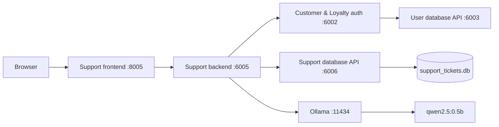
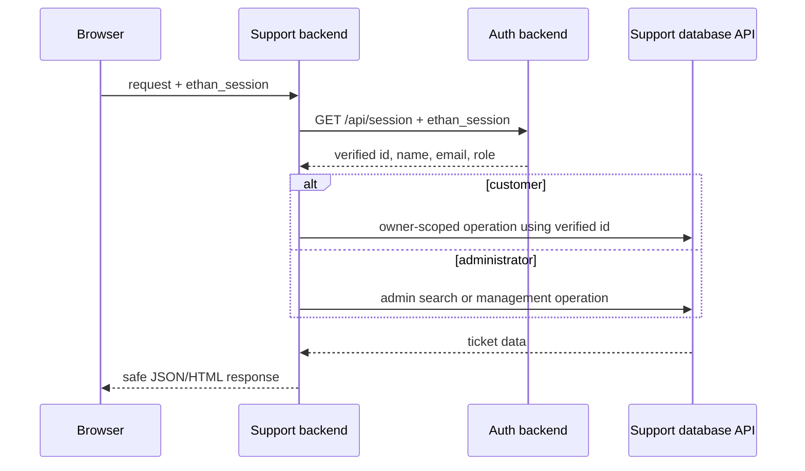
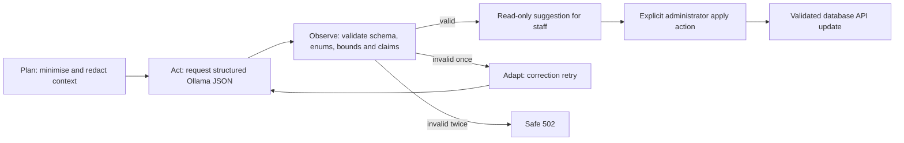

# Release 0 architecture

## Integrated request flow

The browser never accesses the support SQLite database. The support backend
does not mount or import that database. All ticket persistence crosses the
internal database HTTP API. Only `customer-support-database` mounts the
`support-ticket-data` volume.

## Authentication and authorization

Customer identity, sender role and ownership are derived server-side. Customer
routes cannot search all tickets or set category, priority, status or assignee.
Administrator routes enforce the admin role before queue access or mutation.

## AI workflow

Ollama never receives direct database access. Analysis does not persist changes.
The separate apply action records the authenticated administrator ID in
`triage_applied_by`.
